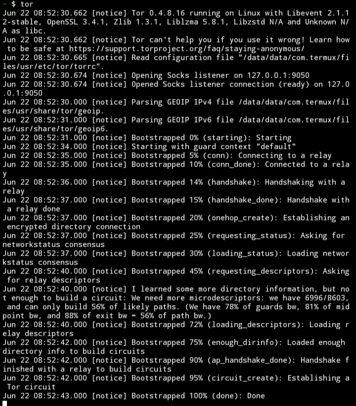
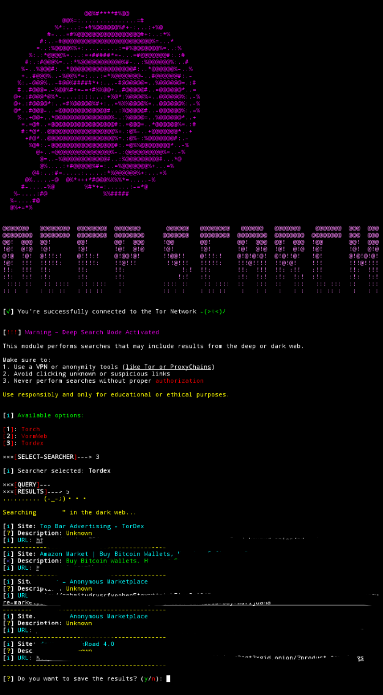
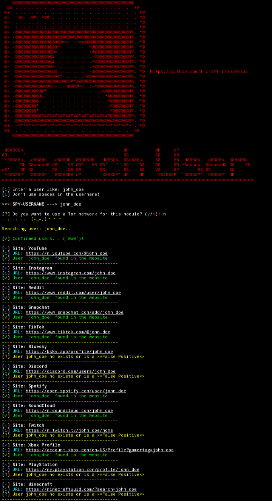
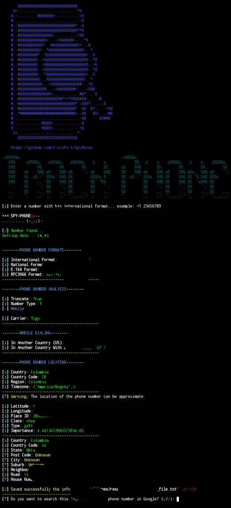
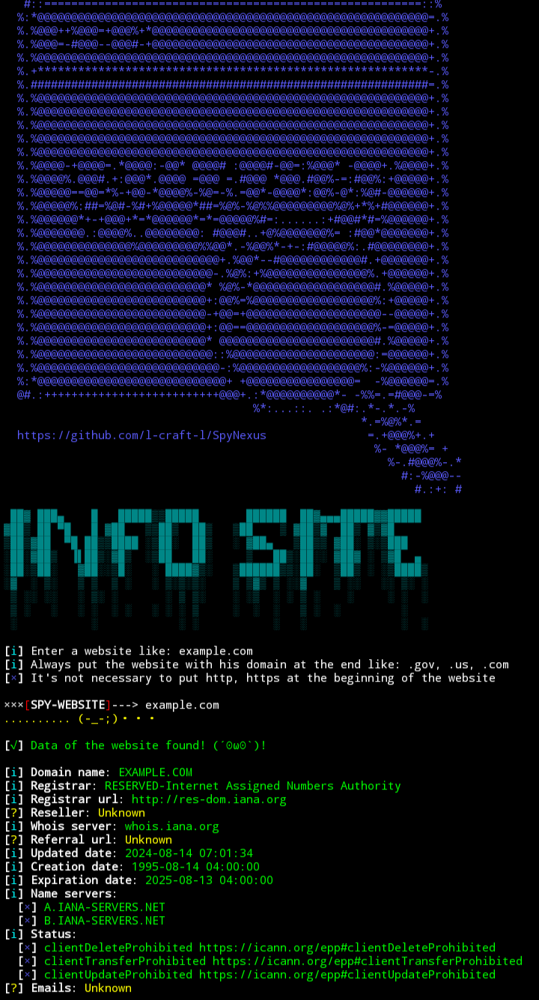

<p align="center">
    
</p>

# 🧠 SpyNexus – The network of espionage and information analysis

---

## 📝 Requirements

```bash
# 🟠 Debian/Ubuntu
sudo apt install python3 python3-pip build-essential libffi-dev libssl-dev

# 🔵 Arch Linux
sudo pacman -S python python-pip base-devel libffi openssl

# 🔷 Create a Virtual Environment (replace "env" with your preferred name)
python3 -m venv env
source env/bin/activate
pip install --upgrade pip

----credits to --->blushingchutney<---
for helping the installation for SpyNexus (^_^)
````

## 📃 installation
```bash
source {env}/bin/activate <-- replace env for your environment.

git clone https://github.com/l-craft-l/SpyNexus.git
cd SpyNexus
python SpyNexus.py
```

🛠️ *It will install the missing packages automatically.*
🔁 *Once done, run the script again to start.*

---

## ❓ What is SpyNexus?

**SpyNexus** is an open-source **OSINT (Open Source Intelligence)** toolkit built in Python, designed for:

* 🛡️ Cybersecurity enthusiasts
* 🧠 Ethical hackers
* 🕵️ Digital investigators
* 📰 Cyber journalists

It combines multiple tools to gather **public intelligence** from different sources — **legally and ethically**.

---

## 🧰 Features (Tools)

1. 🌐 Track your current IP
2. 🖥️ Search public IPs
3. 🌍 Get info from a website (WHOIS)
4. 📱 Track phone numbers
5. 🗺️ Search coordinates or places
6. 👤 Search users on various sites
7. 🖼️ Extract metadata from images
8. 🔍 Google Dorking (with custom commands)
9. 🎩 Deep Search (deep/dark web engines)

---

## 🔐 New Feature: Tor Support for the most Tools of SpyNexus

When using **Google Dorking**, or another tool. Now allows you to choose:

* 🌐 **Standard connection (requests)**
* 🕳️ **Anonymous connection via Tor (SOCKS5 proxy)**

You can select this **before each search**, and the connection will be handled accordingly.

Also you need to open a **new terminal** and start a new tor connection. ***How to do it?***

### 🔨 Installation & initiation of the Tor Network
first, you need to verify if your terminal is **updated**
```
sudo apt update && apt upgrade -y
```
Once done you can type:
```
sudo apt install tor -y
```
Once the installation is **finished you can start a new terminal**
and start, just typing **"tor"** and doing enter.

**Example:**



Once it says **"done"** at the end of the terminal.

**Now you can use the Tor feature in SpyNexus!**

---

### 🔸 Advantages of Tor connection

* 🕵️ Hides your real IP address
* 🧱 Helps bypass regional restrictions
* 🧬 Increases anonymity during recon tasks
* 🌎 Useful for journalists and sensitive research

### 🔻 Disadvantages of Tor connection

* 🐢 Slower than standard connection
* ❌ Some Google results may be blocked or require CAPTCHA
* 🔌 Requires Tor running in the background (port `9050`)

---

## ⚠️ Warning

> I am **not responsible** for any illegal, malicious, or unauthorized use of this tool.
> SpyNexus is intended for **educational, research, and ethical purposes only**.
> Always respect the law, third-party privacy, and terms of service.

---

## 🛡️ Recommendations

* Use a **VPN**
* Run **ProxyChains** if you want extra layers
* Prefer **Tor** for sensitive recon
* 🧠 Use it only on systems you own or have **explicit authorization** to test

---

# 🎭 Examples

***Example 1***



***Example 2***



***Example 3***



***Example 4***



---

## Fun fact ;)

> I developed this entire project from scratch, using only my phone (Termux) and no computer.
> I'm 17 years old, and this is my way of contributing to the OSINT and cyber community.

🙏 If you want to support my work, check out my [Patreon](https://patreon.com/_craft_?utm_medium=unknown&utm_source=join_link&utm_campaign=creatorshare_creator&utm_content=copyLink) or share this project with others.

---

### Be safe. Be smart. Be a good puppy (^_^)
