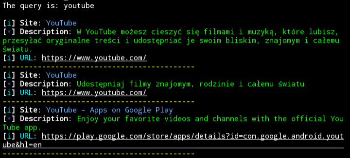
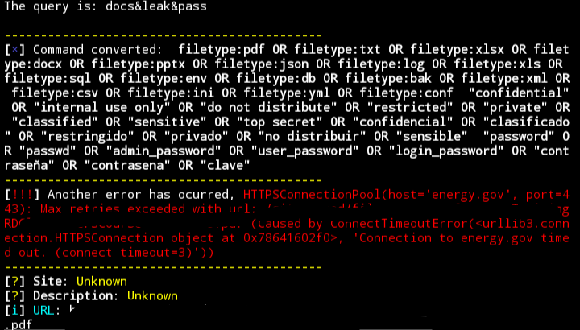
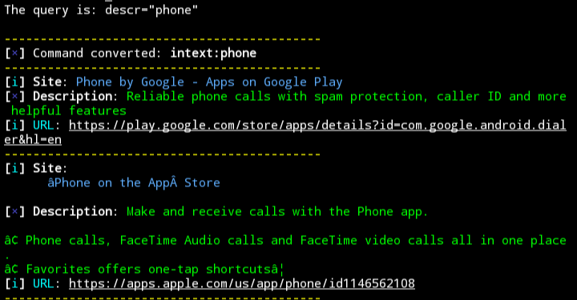
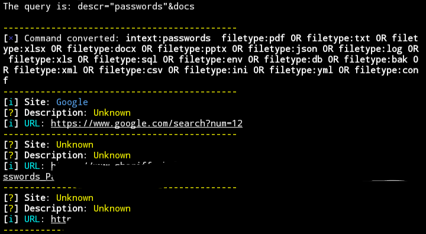
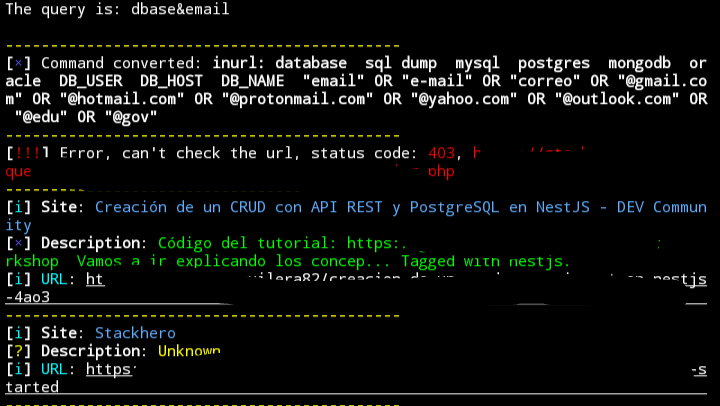
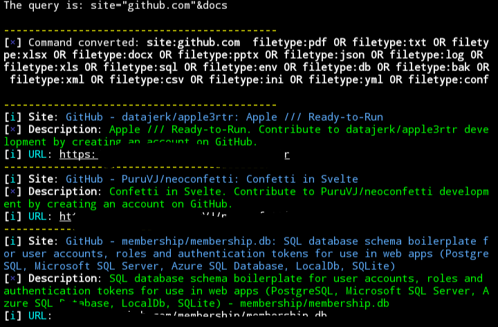
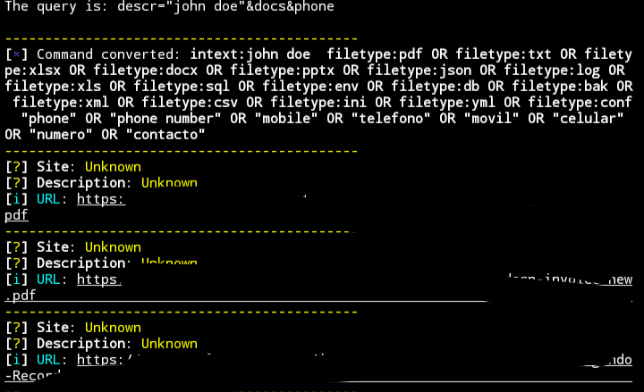

<h3 align="center">Manual of Google Dorking tool</h3>

---

## ❓ ¿How it works?
Well it starts with the function that it's ***make_search*** So it does the normal Google search. You can do a normal search like: *YouTube, Instagram, Facebook* 

**Example:**

and it will give you results with their ***titles, descriptions and links*** And it also works with special Google operators like: **intext, intitle, filetype**, and others.

You must define the number of **Results**, the **File** to save this Results given. 

---

## 🔍 Search_Dork function
**How does it work?**
This function is made of to make this *advanced searches* through Google Search and it does with the **commands** I made like:

- ***doc***: it converts to **filetype**
- ***rel***: it converts to **related**
- ***pass***: it converts to a long list of such keywords of passwords (**pass, password, clave, admin_password, etc...**)

**Example:**

### 🔗 About the `&` separator

When combining multiple commands, always separate them using `&`.  
This character tells the tool where one command ends and another begins.

✅ Correct: `descr="password"&docs`  
❌ Incorrect: `descr="password" docs` ← This will cause an error.

You will see it in the next explinations and examples...

---

and the function Search_Dork does that **if detects that commands automatically** it will convert this commands *to operators of google* and pass it to the **make_search** function to perform the search with these converted operators.

**¿Why?**
well because I realize that are more tools that give you a long list of these operators of google, and that's great ***but*** it's annoying and tedious doing put these searches one by one, And it also takes a lot of time to do these searches, especially if it is very specific and requires a long list of these operators and that's why I made this **search_dork** function.

---

### 📑 There are two types of commands for the function search_dork

These commands are ***🔍 command_search*** and ***🔨 special_command***

The **command_search** It is made to be assigned a **specific value** like:

- **site**: it converts to ***site*** operator.
- **url**: it converts to ***inurl*** operator.
- **descr**: it converts to ***intext*** operator.

So for **example** if you put ***descr*** in the search it's **necessary to to complete it with =""**, and it would *look* something like this: ***descr=""***

**¿What goes inside the quotation marks?**

you put the value whatever you want so for **example** again let's make it like this: ***descr="phone"*** and the function It will convert it to:

*intext:phone*

**Example:**

***disclaimer***: you always need to close the **quotation marks** or else it's gonna display an error.

**Example:**

### 📝 Now the special_command

It's a bunch of commands that are made to be **converted to a long list of values** like:

- **pass**: it converts to a list of ***passwords***
- **adr**: it converts to a list of ***address***
- **keys**: it convert to a list of ***api-keys***

So if you make a search using this two different commands: ***command_search***, and ***special_command*** so let's make an example using this two commands:

***descr="passwords"&docs***

Would look something like this:

### ⚠️ Attention
Im going to mention that the command ***doc*** and the command ***docs*** aren't the same thing.

***Explination:***

In case you need a file in specific, or a few ones, you can use the **doc** command instead of using the **docs** command that gives you the whole list of files.

The command **doc** is a **command_search** so that means that the **doc** command **need a specific value** something like pdf, txt, etc... and it would look like this:

***doc="pdf"***

***And the (docs) commands*** is a **special_command** that gives you the *whole list of files* so you need to type only **docs**.

---

### ➡️ A few examples of using the commands of Search_Dork function

- ***1st Example:***

- ***2nd Example:***

- ***3rd Example:***

---

## Here's the table of all commands available 🛠️

| Command      | Type               | Converts to           | Requires value?  | Short description                                 |
|--------------|--------------------|-----------------------|------------------|---------------------------------------------------|
| `site`       | command_search     | `site:`               | ✅ Yes           | Search within a specific domain                   |
| `title`      | command_search     | `intitle:`            | ✅ Yes           | Search inside page titles                         |
| `url`        | command_search     | `inurl:`              | ✅ Yes           | Match terms inside URLs                           |
| `descr`      | command_search     | `intext:`             | ✅ Yes           | Search inside the page body text                  |
| `rel`        | command_search     | `related:`            | ✅ Yes           | Find websites related to a given one              |
| `doc`        | modified command   | `filetype:`           | ✅ Yes           | Filter by specific file type                      |
| `a_title`    | command_search     | `allintitle:`         | ✅ Yes           | All terms must be present in the title            |
| `a_url`      | command_search     | `allinurl:`           | ✅ Yes           | All terms must be present in the URL              |
| `a_descr`    | command_search     | `allintext:`          | ✅ Yes           | All terms must be present in the body text        |
| `loc`        | command_search     | `location:`           | ✅ Yes           | Search results on a exact location                |
| `auth`       | command_search     | `author:`             | ✅ Yes           | Filter by specific documents with his author      |
| `src`        | command_search     | `source:`             | ✅ Yes           | Filter by sources from an website in specific     |
| `cache`      | command_search     | `cache:`              | ✅ Yes           | Can search cache from an website                  |
| `docs`       | modified command   | List of `filetype:`   | ❌ No            | Returns a full list of common file extensions     |
| `conf`       | modified command   | List of config files  | ❌ No            | Looks for a specific list of configuration files  |
| `pass`       | special_command    | Password keywords     | ❌ No            | Searches for common password-related terms        |
| `email`      | special_command    | Email-related terms   | ❌ No            | Looks for email addresses or patterns             |
| `phone`      | special_command    | Phone number patterns | ❌ No            | Looks for phone numbers or country formats        |
| `adr`        | special_command    | Address terms         | ❌ No            | Looks for physical addresses or location data     |
| `keys`       | special_command    | API keys / tokens     | ❌ No            | Searches for leaked access keys or tokens         |
| `leak`       | special_command    | Leak-related keywords | ❌ No            | Searches for breach and leak terms                |
| `dbase`      | special_command    | Database keywords     | ❌ No            | Injects search terms related to exposed databases |
| `breach`     | special_command    | Breach keywords       | ❌ No            | Injects breach-related search terms               |
| `index`      | special_command    | Search for index      | ❌ No            | Searches for index terms, mostly on a website     |
| `cv`         | special_command    | CVs, resumes, terms   | ❌ No            | Searches for curriculum vitae, resumes on a person|
| `invoice`    | special_command    | Billing-terms         | ❌ No            | Search for exposed invoice/billing documents      |
| `contr`      | special_command    | Search for contracts  | ❌ No            | Looks for confidential/exposed contracts          | 
| `kword="..."`| special_command    | Custom keyword        | ✅ Yes (with `=`)| Adds a user-defined keyword to the search         |

---

## 🗒️ The multi_search function

The **multi_search** function it's where you can do ***multiple searches*** using the **search_dork function** at the same time.

**¿What does mean?**

It means that you can use the **search_dork function multiple times**.

**How it works?**

All you need it's to put the **amount** of multiple searches that you want, and this function ***store this amount of multiple searches*** in a list, once you finished to put this searches, the ***function automatically will perform this searches*** one by one.

**Example:**

And that's it, if you don't know where is the multiple searches just go to:

***8 Google Dorking > 7 (custom) > 2 (Multiple Searches)*** 

And now, you can perform the amount of searches that you want...

If you don't know the commands, you should check the Explination of **Search_Dork function** that was given from ***above.*** (^-^)

---

### And that's it! (⁠>⁠▽⁠<⁠) If you can perform this commands and using the multi_search function you can search whatever you want, it's now your imagination to search your objective. just be a good puppy ;)
